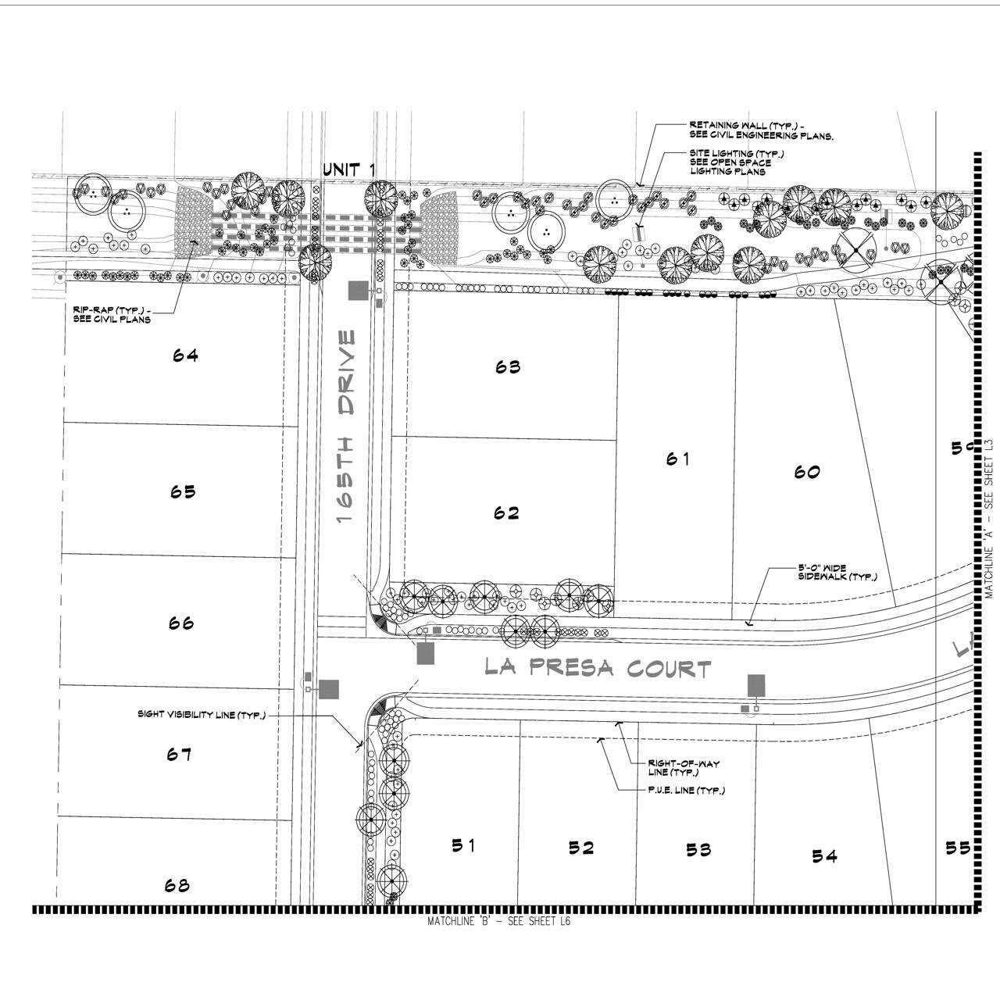
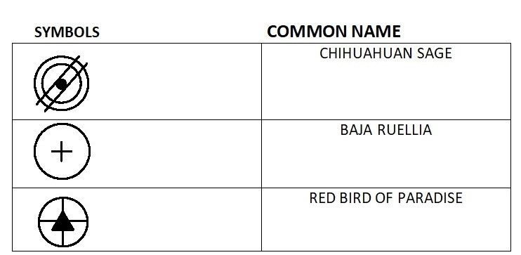

# Symbol Detection on landmark
Symbol detection is done using state-of-art model of yoloV5. The model successfully achieved good precision and recall. 

## Dataset
Real world dataset is used for this problem and object labeling is done using online tool available called LabelImg
No public dataset is available for this problem so I used real world images. Manual labelling is done on each image using LabelImg Tool. [download](https://tzutalin.github.io/labelImg/)
with Yolo txt labels 

## Pre-processing Dataset
Whole dataset is resize into 1280x1280 and split into training and validation in 80:20 ratio.

## original Image

## Labels
These are the selected symbols that I need to detect in orginal image.

## Results 

